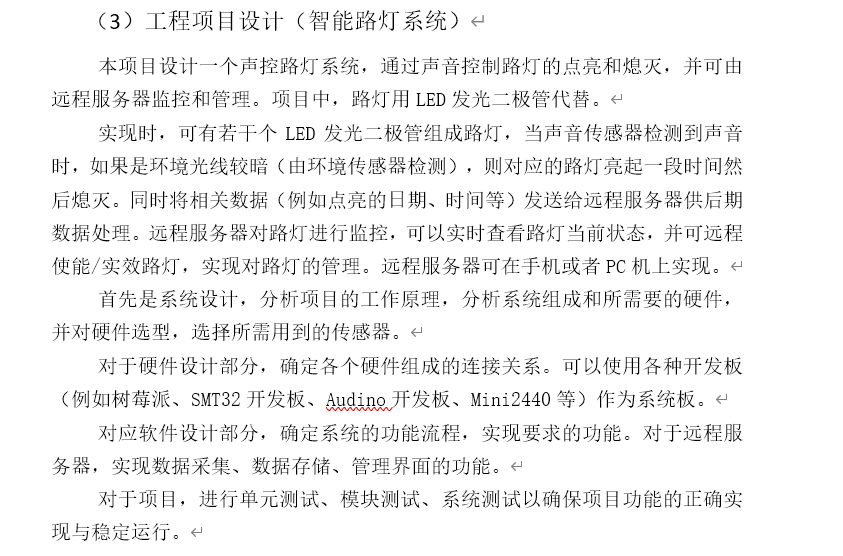
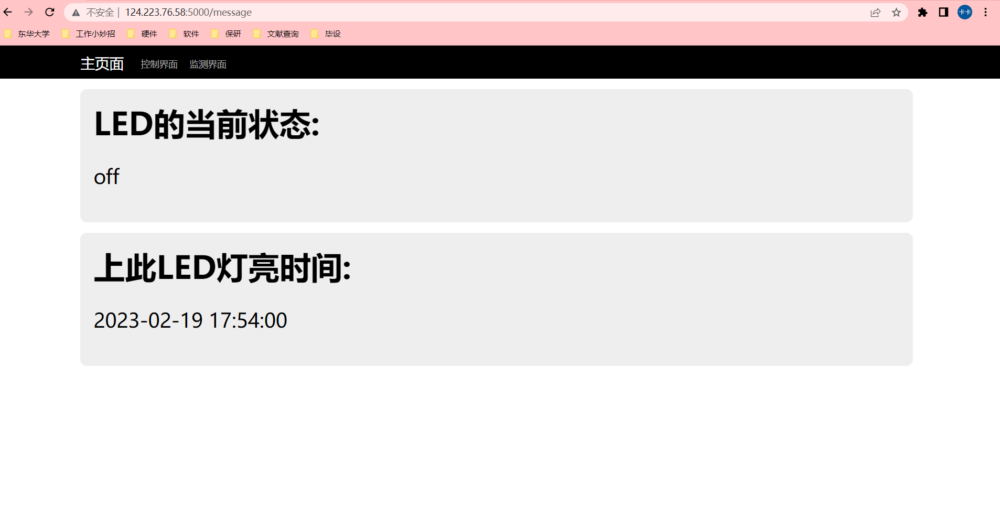

# iot_keshe要求

 点灯课设



# 运行方法：

环境依赖：云端安装flask即可，树莓派几乎不用安装什么

将cloud里的web_flask文件夹全拖到云端。将raspberry文件夹下的all.py拖到树莓派里。

更改自己的云服务器ip，包括socket端口号。（云端和树莓派都需要改）

**运行：**

```shell
# 云端
python index.py
```

```shell
# 树莓派
python all_button.py     # 按键简化版本
python all_sensor.py     # 传感器版本
```

访问网址：

```shell
http://124.223.76.58:5000/index     # 主页
```

界面：




**目前不支持状态刷新，后续将使用websocket实现静态界面的实时刷新。**

# 开发过程

## 树莓派引脚检测（中断）

### 简介

适用于引脚的状态变化，以另一个线程进行变化后的函数执行。

### 用法

#### 初始化

将引脚设为输入模式

```python
import RPi.GPIO as GPIO
GPIO.setmode(GPIO.BCM) 
channel = 17
GPIO.setup(channel, GPIO.IN, pull_up_down=GPIO.PUD_UP)
```

引脚图如下：


BCM模式即 ``GPIOxx``

#### 主体函数

```python
def my_callback(channel):
    print('This is a edge event callback function!')
    print('Edge detected on channel %s'%channel)

GPIO.add_event_detect(channel, GPIO.RISING, callback=my_callback, bouncetime=400)
```

参数含义：

* channel         GPIO
* callback         回调函数
* bouncetime  防抖时间，默认300ms

#### 测试总代码

GPIO17与ground接按钮斜对边两侧

```python
import RPi.GPIO as GPIO
GPIO.setmode(GPIO.BCM) 
channel = 17
GPIO.setup(channel, GPIO.IN, pull_up_down=GPIO.PUD_UP)

if GPIO.input(channel):
    print('Input was HIGH')
else:
    print('Input was LOW')


def my_callback(channel):
    print('This is a edge event callback function!')
    print('Edge detected on channel %s'%channel)
GPIO.add_event_detect(channel, GPIO.RISING, callback=my_callback, bouncetime=300)

while(1):
    if(1==2):
        print(1)
```

最终工程使用的中断：

```python
import RPi.GPIO as GPIO

GPIO.setmode(GPIO.BCM) 
button = 17                   # 后期换成传感器
GPIO.setup(button, GPIO.IN, pull_up_down=GPIO.PUD_UP)   # 引脚默认高电平（拉高），按下后接地引脚电平被拉低
GPIO.output(LED,GPIO.LOW)

# 回调函数，按下按键的中断执行函数，现象为灯亮起且发送两次数据给云端
def my_callback(button):
    data = time.strftime("%Y-%m-%d %H:%M:%S", time.localtime()) + '  raspberry'      # 当前时间
    print('按键按下')

    send_data(1,data,1)           # 发送数据（状态为亮起）
    GPIO.output(LED,GPIO.HIGH)

    time.sleep(led_delay_time)

    send_data(1,data,0)           # 发送数据（状态为灭掉）
    GPIO.output(LED,GPIO.LOW)

GPIO.add_event_detect(button, GPIO.RISING, callback=my_callback, bouncetime=400)    # 检测button的中断函数
```

```

```

## 树莓派与云端socket通信

### 简介

socket支持双方相互通信，且python3版本自带无需安装。一方为云端时需要在控制台为socket开一个port。

只要需要接收数据，必须单开一个线程一直监听着，直到收到数据才继续往下执行代码

### 用法

#### 建立连接

raspyberry端：

```python
HOST = '124.223.76.58'  # 比如 99.100.101.102是你的服务器的公网IP
PORT = 7789  # IP开放的socket端口
BUFSIZ = 1024
ADDR = (HOST, PORT)

try:
    s = socket.socket(socket.AF_INET, socket.SOCK_STREAM)
    s.connect(ADDR)
except socket.error as msg:
    print(msg)
    print(sys.exit(1))
```

最好将s变成全局变量，便于后续的数据发送

cloud：

与树莓派几乎一样，见下面总代码

#### 测试总代码

cloud:

```python
import socket
import sys

def socket_service_data():
    # 连接
    try:
        s = socket.socket(socket.AF_INET, socket.SOCK_STREAM)
        s.setsockopt(socket.SOL_SOCKET, socket.SO_REUSEADDR, 1)
        s.bind(ADDR)  # 在不同主机或者同一主机的不同系统下使用实际ip
        s.listen(10)
    except socket.error as msg:
        print(msg)
        sys.exit(1)
    print("Wait for Connection..................")

    sock, addr = s.accept()
  
    while True:
        # 收
        buf = sock.recv(BUFSIZ)  # 接收数据
        buf1 = buf.decode('utf-8')  # 解码
        if not buf:
            break
        print('Received message:', buf1)
    # 关闭socket
    sock.close()


if __name__ == '__main__':
    # 初始化
    name = socket.gethostname()
    HOST = socket.gethostbyname('10.0.12.13')  # 获取阿里云服务器私网IP，使用ifconfig可查询
    PORT = 7789
    BUFSIZ = 1024
    ADDR = (HOST, PORT)

    socket_service_data()


```

raspberry:

```python
import RPi.GPIO as GPIO
import socket
import sys
import time

HOST = '124.223.76.58'  # 比如 99.100.101.102是你的服务器的公网IP
PORT = 7789  # IP开放的socket端口
BUFSIZ = 1024
ADDR = (HOST, PORT)

GPIO.setmode(GPIO.BCM) 
channel = 17
GPIO.setup(channel, GPIO.IN, pull_up_down=GPIO.PUD_UP)

if GPIO.input(channel):
    print('Input was HIGH')
else:
    print('Input was LOW')


def my_callback(channel):
    data = 'hello' + time.strftime("%Y-%m-%d %H:%M:%S", time.localtime())
    print('This is a edge event callback function!')
    print('Edge detected on channel %s'%channel)
    s.send(data.encode('utf-8'))

GPIO.add_event_detect(channel, GPIO.RISING, callback=my_callback, bouncetime=400)

if __name__ == '__main__':
    try:
        s = socket.socket(socket.AF_INET, socket.SOCK_STREAM)
        s.connect(ADDR)
    except socket.error as msg:
        print(msg)
        print(sys.exit(1))

    while(1):
        if(1==2):
            print(1)
```

先运行云端再运行树莓派，否则连接被拒绝

现象：

按键按下发送当前时间，显示在cloud终端上。


## sqlite3云端数据库

### 简介

falsk自带的数据库，凑合用。将发送过来的时间存入数据库。

### 用法

#### 创建数据库

```python
if not os.path.isfile('data.db'):
    conn = sqlite3.connect('data.db')
    c = conn.cursor()
    c.execute("""CREATE TABLE data (
        Id INTEGER PRIMARY KEY AUTOINCREMENT,
        date_time text, 
        field integer
        )""")
    conn.commit()
    conn.close()
```

即创建名为data的数据库，并创建名为data的table。

#### 增加数据

```python
def date_save(device_id):
    conn = sqlite3.connect('data.db')
    c = conn.cursor()
    date_time_str = now = time.strftime("%Y-%m-%d %H:%M:%S", time.localtime())
    c.execute("INSERT INTO data VALUES(:Id,  :date_time, :device_id)",
            {'Id': None,  'date_time': date_time_str,  'device_id': int(device_id)})
    conn.commit()
    c.close()
    conn.close()

date_save(3)
date_save(2)
date_save(1)

```

#### 查询

```python
conn = sqlite3.connect('data.db')
c = conn.cursor()
max_id = c.execute("SELECT MAX(rowid) FROM data ").fetchone()
sql = "SELECT * FROM data "
c.execute(sql)  #最新一条
row1 = c.fetchone()
```

```python
(1, '2023-02-12 08:51:06', 3)
```

rowid即默认的keyworld

| ID | date_time           | device_id |
| -- | ------------------- | --------- |
| 1  | 2023-02-12 08:51:06 | 1         |
| 2  | 2023-02-12 08:51:06 | 2         |

#### 测试总代码

创建data数据库与data的table，插入三条数据并查询（数据库格注意不是最后用的，少了一个状态值）

```python
import sqlite3
import os
import time

if not os.path.isfile('data.db'):
    conn = sqlite3.connect('data.db')
    c = conn.cursor()
    c.execute("""CREATE TABLE data (
        Id INTEGER PRIMARY KEY AUTOINCREMENT,
        date_time text, 
        device_id integer
        )""")
    conn.commit()
    conn.close()


def date_save(device_id):
    conn = sqlite3.connect('data.db')
    c = conn.cursor()
    date_time_str = now = time.strftime("%Y-%m-%d %H:%M:%S", time.localtime())
    c.execute("INSERT INTO data VALUES(:Id,  :date_time, :device_id)",
            {'Id': None,  'date_time': date_time_str,  'device_id': int(device_id)})
    conn.commit()
    c.close()
    conn.close()


date_save(3)
date_save(2)
date_save(1)


# 查询
conn = sqlite3.connect('data.db')
c = conn.cursor()
max_id = c.execute("SELECT MAX(rowid) FROM data ").fetchone()
sql = "SELECT * FROM data "
c.execute(sql)  #最新一条

row1 = c.fetchone()
print(row1,max_id)
```

## 云端控制树莓派（点灯）

### 简介

现象：云端发送1控制led亮三秒。

做法：将表单提交的数据获取到并发送给树莓派即可。树莓派处于监听状态，一旦发送过来即判断是否将灯点亮

### 双线程

```python
from threading import Thread
import time
def func1():
    while(1):
        print('1')
        time.sleep(1)

def func2():
    while(1):
        print("2")
        time.sleep(1)

if __name__ == '__main__':
    Thread(target = func1).start()
    Thread(target = func2).start()
```

别运行要不然关不上哈哈哈

## 云端检测灯的状态及显示上次点灯时间

### 简介

数据库存在灯的状态与时间参数。

数据库的每一条数据都是树莓派发送过来的，灯亮发送一次，灯灭发送一次，将其全部存起来即可。状态就是数据库最新一条数据的状态，时间也是（为了简单这里忽略了灯的延迟时间）

### 用法

看index.py代码吧，主要是查询完数据库后将参数传给网页，刷新一下就更新了。
