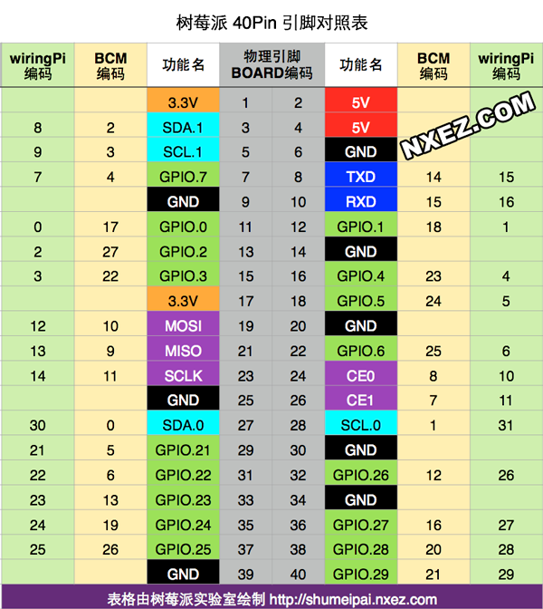
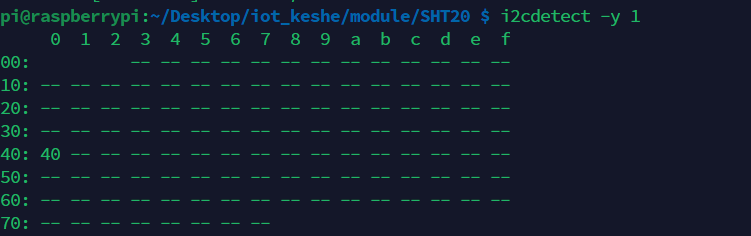
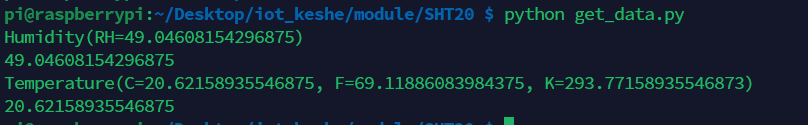

使用了I2C通信及第三方库。

### 打开树莓派I2C

```shell
sudo raspi-config
```

### 连接

树莓派支持两个I2C，需要将模块上的SDA和SCL分别与树莓派上的连接。



查询总线地址(连接后才有值))：

```shell
i2cdetect -y 1
```




### 使用第三方库

[原链接](https://github.com/nickoala/sensor)

将sensor文件夹放到树莓派并转到此（ls输出本文件夹），执行安装命令：``pip3 install sensor``。

安装成功后，尝试在终端中导入sensor成功，但文件中不成功，需将其地址存放到库的寻址地址中。

```python
import sys
sys.path    # 当前库的寻址地址
sys.path.append('/home/pi/Desktop/iot_keshe/module')   # 自己的地址
```


